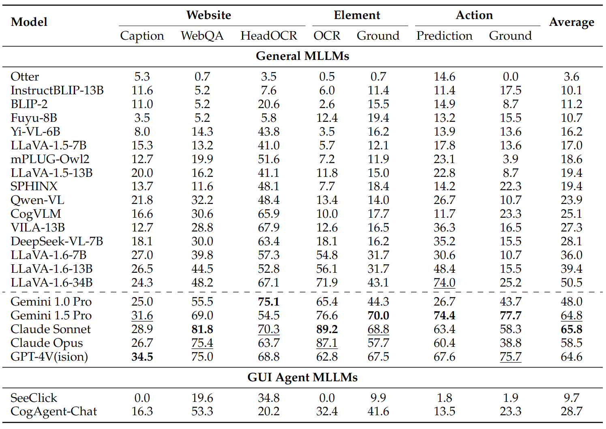

# VisualWebBench

This repo contains the evaluation framework for the paper: [VisualWebBench: How Far Have Multimodal LLMs Evolved in Web Page Understanding and Grounding?](https://arxiv.org/abs/2404.05955)

[**🌐 Homepage**](https://visualwebbench.github.io/) | [**🤗 Dataset**](https://huggingface.co/datasets/visualwebbench/VisualWebBench) | [**📖 arXiv**](https://arxiv.org/abs/2404.05955)


## Introduction

We introduce **VisualWebBench**, a multimodal benchmark designed to assess the **understanding and grounding capabilities of MLLMs in web scenarios**. VisualWebBench consists of **seven tasks**, and comprises **1.5K** human-curated instances from **139** real websites, covering 87 sub-domains. We evaluate 14 open-source MLLMs, Gemini Pro, Claude 3, and GPT-4V(ision) on VisualWebBench, revealing significant challenges and performance gaps. Further analysis highlights the limitations of current MLLMs, including inadequate grounding in text-rich environments and subpar performance with low-resolution image inputs. We believe VisualWebBench will serve as a valuable resource for the research community and contribute to the creation of more powerful and versatile MLLMs for web-related applications.


## Update
* [2024/4/17]: Update results of Gemini 1.5 Pro


## Benchmark Construction
We introduce VisualWebBench, a comprehensive multimodal benchmark designed to assess the capabilities of MLLMs in the web domain. Inspired by the human interaction process with web browsers, VisualWebBench consists of seven tasks that map to core abilities required for web tasks: captioning, webpage QA, heading OCR, element OCR, element grounding, action prediction, and action grounding, as detailed in the figure. The benchmark comprises 1.5K instances, all uniformly formulated in the QA style, making it easy to evaluate and compare the performance of different MLLMs.

The proposed VisualWebBench possesses the following features:
- **Comprehensiveness**: VisualWebBench spans 139 websites with 1.5K samples, encompassing 12 different domains (e.g., travel, sports, hobby, lifestyle, animals, science, etc.) and 87 sub-domains.
- **Multi-granularity**: VisualWebBench assesses MLLMs at three levels: website-level, element-level, and action-level.
- **Multi-tasks**: VisualWebBench encompasses seven tasks designed to evaluate the understanding, OCR, grounding, and reasoning capabilities of MLLMs.
- **High quality**: Quality is ensured through careful human verification and curation efforts.


## Evaluation


We provide the evaluation code for GPT-4V, Claude, Gemini, and LLaVA 1.6 series.
See `run.sh` for more details.

The experimental results are as follows:


## How to Add a Model
1. Implement a model adapter in `model_adapters`. See `model_adapters/llava_adapter.py` for an example.
2. Modify `run.py` to add your model.
3. Write a config file in `configs`.

## Contact
- Junpeng Liu: [jpliu@link.cuhk.edu.hk](jpliu@link.cuhk.edu.hk)
- Yifan Song: [yfsong@pku.edu.cn](yfsong@pku.edu.cn)
- Xiang Yue: [xyue2@andrew.cmu.edu](xyue2@andrew.cmu.edu)

## Citation
If you find this work helpful, please cite our paper:
```
@misc{liu2024visualwebbench,
      title={VisualWebBench: How Far Have Multimodal LLMs Evolved in Web Page Understanding and Grounding?}, 
      author={Junpeng Liu and Yifan Song and Bill Yuchen Lin and Wai Lam and Graham Neubig and Yuanzhi Li and Xiang Yue},
      year={2024},
      eprint={2404.05955},
      archivePrefix={arXiv},
      primaryClass={cs.CL}
}
```
